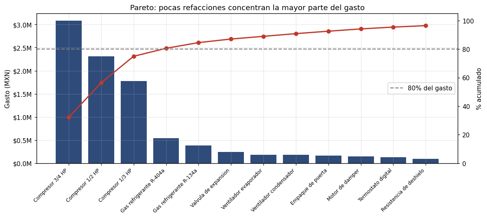
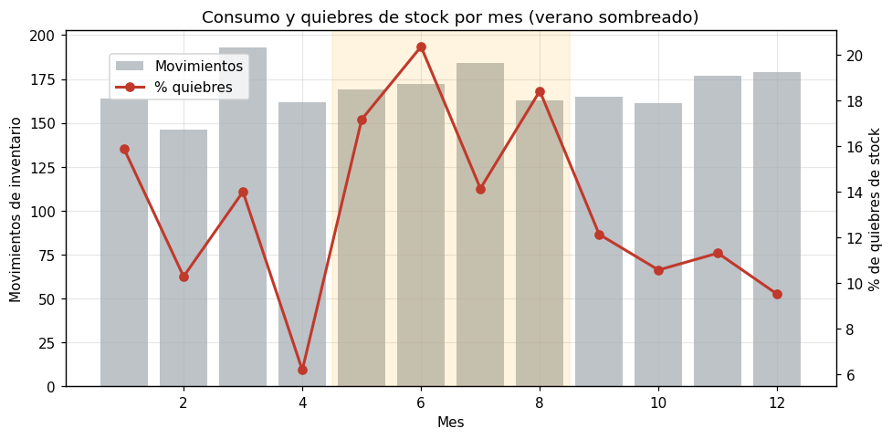

# Análisis de costos e inventario de refacciones de refrigeración

Análisis de 2,124 movimientos de inventario para identificar dónde se concentra el gasto en
refacciones y qué piezas provocan quiebres de stock que frenan la operación de servicio.

**Herramientas:** Python · pandas · matplotlib · SQL

---

## El problema

En una operación de refrigeración, las refacciones son el segundo costo más grande después de la
mano de obra, y su disponibilidad decide si un servicio se cierra a tiempo. Comprar de más
inmoviliza dinero; comprar de menos genera quiebres que paran servicios.

> **¿En qué refacciones se concentra el gasto, y dónde se producen los quiebres de stock que frenan
> la operación?**

---

## Hallazgo principal

**El 85% del gasto vive en solo 5 refacciones.**



Los tres tipos de compresor concentran el **75%** del presupuesto; sumando dos gases refrigerantes
se llega al **85%**. De 18 refacciones distintas, solo hay que vigilar de cerca cinco para controlar
la mayor parte del gasto.

Y el patrón de quiebres es el peor posible: **las piezas críticas se agotan el doble** (18%) que las
no críticas (9%), justo las que detienen un servicio cuando faltan.

---

## Resultados

| KPI | Valor |
|---|---|
| Gasto anual analizado | $9.5M MXN |
| Refacciones que concentran el 80% del gasto | 4 piezas |
| Categoría de mayor gasto | Compresores (75%) |
| Tasa global de quiebres de stock | 13.4% |
| Tasa de quiebre en piezas críticas | 18% |
| Meses con más quiebres | Mayo a agosto |

**Otros hallazgos:**

1. **Los quiebres se disparan en verano** (mayo–agosto), cuando el consumo de compresores y gas
   sube por el pico de fallas y el almacén no alcanza a reabastecerse.
2. **Norte y Sureste son las bases más vulnerables:** combinan mayor lead time con mayor tasa de quiebre.



---

## Recomendaciones

| # | Acción | Fundamento |
|---|---|---|
| 1 | Control estricto de stock mínimo a las 5 refacciones del 80% del gasto | Ahí está el presupuesto y el ahorro |
| 2 | Elevar el punto de reorden de piezas críticas antes de verano | Duplican la tasa de quiebre en temporada alta |
| 3 | Más inventario de seguridad de compresores en Norte y Sureste | Alto lead time + alta tasa de quiebre |
| 4 | Negociar lead time con el proveedor de compresores | Familia más cara y de reabastecimiento más lento |

---

## Conexión con mi otro proyecto

Este análisis complementa mi [análisis de tiempos de respuesta en servicios](../analisis-servicios-refrigeracion).
Allá encontré que los servicios **con refacción tardan más del doble** en cerrarse; aquí identifico
**exactamente qué cinco piezas** mantener en stock para evitar esos retrasos. La conclusión conjunta:
no hay que inflar todo el inventario, sino blindar las cinco refacciones que mueven la operación.

---

## Estructura

```
├── datos/
│   ├── inventario_refacciones.csv     2,124 movimientos
│   └── catalogo_refacciones.csv       Catálogo de 18 SKUs
├── notebooks/
│   └── analisis_inventario_refacciones.ipynb
├── sql/
│   └── consultas.sql                  8 consultas
├── imagenes/
├── generar_datos.py
└── README.md
```

---

## Cómo reproducirlo

```bash
pip install pandas numpy matplotlib jupyter
jupyter notebook notebooks/analisis_inventario_refacciones.ipynb
```

---

## Sobre los datos

Dataset **sintético**, generado con `generar_datos.py`. La estructura y los problemas de calidad
replican los de un sistema real de gestión de almacén de refacciones, con el que trabajé coordinando
servicios de refrigeración comercial. No contiene información de ninguna empresa real.

---

**Kenji Teramoto** — Analista de Datos Jr.
Ingeniero Industrial · kenjiteramoto4@gmail.com
